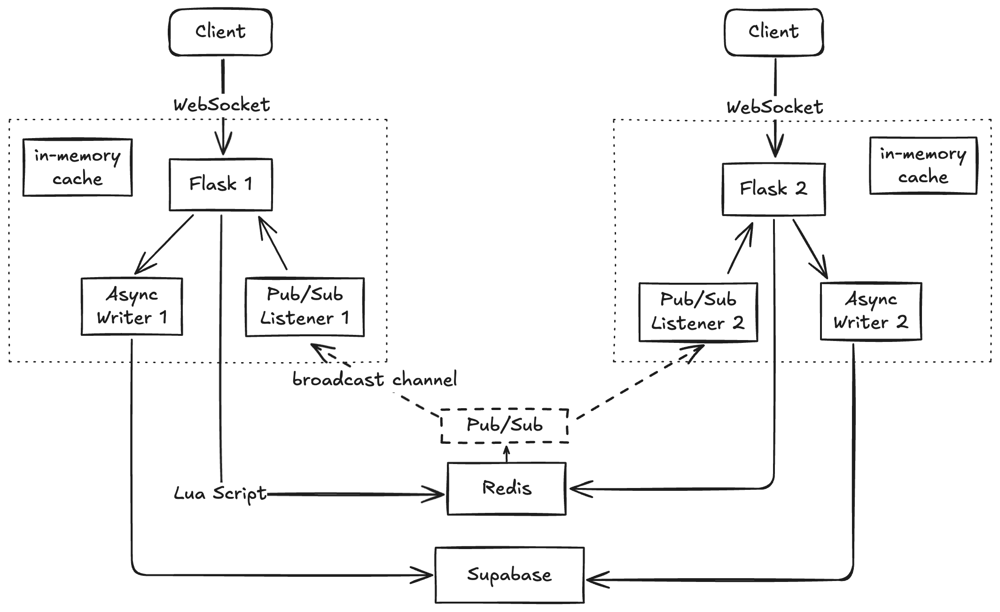

# Collab Todo - Real-Time Collaborative Service

A production-ready real-time collaboration service for todo lists, featuring multi-tier caching, atomic operations, and cross-server synchronization. Built with Flask-SocketIO, Redis, and Supabase.

---

## Overview

This service provides real-time collaborative editing of todo lists with:

- **Multi-tier caching** (L1/L2/L3) for optimal performance
- **Atomic operations** via Redis Lua scripts
- **Cross-server sync** using Redis Pub/Sub
- **Revision-based conflict detection** for offline/concurrent edits
- **WebSocket real-time updates** for instant collaboration
- **Horizontal scalability** with stateless architecture

Other features:

- Pydantic schema validation
- JWT based verification
- Well-documented API and events

---

## Architecture

### **High-Level Architecture**



### **Component Responsibilities**

| Component             | Purpose                                         | Technology            |
| --------------------- | ----------------------------------------------- | --------------------- |
| **Client**            | UI, optimistic updates, WebSocket connection    | Next.js/React         |
| **Flask App**         | HTTP/WebSocket handlers, business logic         | Flask-SocketIO        |
| **In-memory State**   | Serves as L1 cache (per-server)                 | Python dict           |
| **Data Interchange**  | Serves as L2 cache, Shared state across servers | Redis                 |
| **Long-term Storage** | Serves as L3 storage, persistent database       | Supabase (PostgreSQL) |
| **Pub/Sub**           | Cross-server event broadcasting                 | Redis Pub/Sub         |
| **Worker Queue**      | Async database writes                           | Python Queue + Thread |

---

## Synchronization Strategy

### **Multi-Tier Caching (L1 → L2 → L3)**

```bash
Read Flow


Client Request
       │
       ▼
┌──────────────┐
│  L1 (Memory) │ ───► HIT? ───► Return (< 1ms)
└──────┬───────┘
       │ MISS
       ▼
┌──────────────┐
│  L2 (Redis)  │ ───► HIT? ───► Populate L1, return (1-5ms)
└──────┬───────┘
       │ MISS
       ▼
┌──────────────┐
│ L3 (Supabase)│ ───► LOAD ───► Populate L2 & L1, return (50-100ms)
└──────────────┘

---

Write Flow


Client Update Request
         │
         ▼
┌───────────────────┐
│   Lua Script      │  Steps:
│   (Redis)         │  1. Fetch revision based on Redis clock
│                   │  2. Update L2 hash
│                   │  3. PUBLISH to Pub/Sub
└──────────┬────────┘
           │
    ┌──────┴────────┐
    │               │
    ▼               ▼
Update L1        Pub/Sub
    │               │
    ▼               ▼
Queue L3 Write   All Servers -> Update L1 -> Emit to Clients
```

### **Revision-Based Conflict Detection**

Each list has a monotonically increasing revision number (epoch milliseconds):

```python
# Client sends update with their current revision
{
  "item_id": "item-123",
  "updates": {...},
  "client_rev": "1730000000000"
}

# Server checks:
if client_rev < server_rev:
    # Client is stale - send full snapshot
    emit('list_snapshot', current_state)
    reject_update()
else:
    # Accept update, increment revision
    new_rev = time.time() * 1000  # New revision
    update_item(...)
```

---

## Code Structure

```bash
services/collab/
├── config.py                    # Configuration management
├── main.py                      # Application factory
│
├── core/                        # Core infrastructure
│   ├── coordinator.py           # L1↔L2 sync, Lua scripts
│   ├── state_manager.py         # L1 cache + connection tracking
│   └── pubsub_listener.py       # Redis Pub/Sub subscriber
│
├── handlers/                    # WebSocket event handlers
│   ├── connection_handler.py    # connect, disconnect, join
│   ├── item_handler.py          # add_item, update_item, delete_item
│   └── list_handler.py          # create_list, share_list
│
├── services/                    # Business logic
│   ├── item_service.py          # Item CRUD + orchestration
│   ├── list_service.py          # List CRUD + orchestration
│   └── permission_service.py    # Authorization logic
│
├── models/                      # Data access layer
│   ├── item.py                  # TodoItem model + ItemRepository
│   └── list.py                  # TodoList model + ListRepository
│
├── schemas/                     # Pydantic validation schemas
│   ├── item_schema.py           # AddItemSchema, UpdateItemSchema, etc.
│   └── list_schema.py           # CreateListSchema, ShareListSchema
│
├── middleware/                  # Request middleware
│   └── middleware.py            # Auth decorator, validation decorator
│
├── worker/                      # Background workers
│   └── supabase_writer.py       # Async L3 write queue
│
└── utils/                       # Utilities
    ├── constants.py             # Event names, operations
    ├── logger.py                # Structured logging
    └── timestamp.py             # Time utilities
```

### **Layer Responsibilities**

```bash
Request Flow Chart


Client WebSocket Event
  └─> SocketIO
       └─> Handlers
            ├─> Auth check (middleware)
            ├─> Schema validation
            ├─> Permission check
            ├─> Error Handling
            │
            └─> Services
                ├─> Business logic ─> Return revision if needed
                ├─> Sync cache
                ├─> Emit action done message to client
                │
                ├─> Coordinator
                │     └─> Update cache
                │
                └─> Write worker thread
                      └─> Repository
                            └─> Write to Supabase
```

---

## Data Flow Examples

### **Example 1: Add Item**

```bash
1. Client A emits 'add_item'
   ├─> { list_id, name, description }
   │
2. Handler validates + checks permission
   │
3. ItemService.add_item()
   ├─> Coordinator.add_item()
   │   ├─> Redis Lua script:
   │   │   ├─> Generate new_rev = time.time()
   │   │   ├─> Add item to Redis hash
   │   │   └─> PUBLISH 'item_added' to Pub/Sub
   │   │
   │   └─> Update L1 cache with new item + rev
   │
   └─> Queue Supabase write (async)

4. Pub/Sub message received by ALL servers
   ├─> Server A (originator):
   │   ├─> Update L1 (already done)
   │   └─> Emit to local clients
   │
   └─> Server B:
       ├─> Update L1 cache
       └─> Emit to local clients

5. Background worker writes to Supabase
   └─> Persistent storage updated
```

### **Example 2: Conflict Resolution**

```bash
Scenario: Server restarts, client has stale revision

1. Client has rev=500 (from before restart)
2. Client sends update_item with rev=500
   │
3. Server L1 cache is empty (restart)
   │
4. Coordinator.check_and_load_list_cache(list_id, client_rev="500")
   ├─> L1 miss → Load from Redis
   ├─> Redis has rev=300 (stale)
   ├─> Client rev (500) > Redis rev (300)
   │   └─> Force refresh from Supabase
   │       └─> Load fresh data with rev=600
   │
5. Compare: client_rev (500) < server_rev (600)
   └─> Conflict detected!
       ├─> Send full snapshot to client
       │   emit('list_snapshot', { items, rev: 600 })
       └─> Reject update
           emit('error', { message: 'Revision conflict' })

6. Client receives snapshot
   ├─> Update local state to rev=600
   └─> # Retry update with new revision (Not implemented)
```

### **Example 3: Cross-Server Sync**

```bash
User opens app on Phone (Server A) and Laptop (Server B)

1. Phone creates item
   ├─> Connected to Server A
   │
2. Server A processes request
   ├─> Update L1 on Server A
   ├─> Update L2 (Redis)
   └─> PUBLISH to Pub/Sub

3. Redis Pub/Sub broadcasts to all servers
   │
4. Server B receives Pub/Sub message
   ├─> Update L1 on Server B
   └─> Emit to local clients
       └─> Laptop receives update

Result: Laptop sees item appear instantly
```

---

## Installation & Setup

### **Prerequisites**

- Python 3.13+
- Redis 7+
- Supabase account
- Node.js 18+ (for client)
- uv (python environment)

### **1. Clone Repository**

```bash
git clone https://github.com/yongtao-wang/collab-todo.git
cd collab-todo/services/collab
```

### **2. Install Dependencies**

```bash
# Create virtual environment
uv sync
```

### **3. Configure Environment**

Create `.env` file:

```bash
# Flask
ENV=development
HOST=0.0.0.0
PORT=7788
DEBUG=True

# JWT
JWT_SECRET_KEY=your-super-secret-jwt-key-change-in-production

# Redis
REDIS_HOST=localhost
REDIS_PORT=6379

# Supabase
SUPABASE_URL=https://your-project.supabase.co
SUPABASE_SERVICE_KEY=your-service-role-key

# Worker
WRITER_QUEUE_SIZE=1000
```

### **4. Setup Redis**

#### **Option A: Local Installation**

```bash
# macOS
brew install redis
brew services start redis

# Ubuntu/Debian
sudo apt-get install redis-server
sudo systemctl start redis

# Verify
redis-cli ping  # Should return "PONG"
```

#### **Option B: Docker**

```bash
docker run -d \
  --name collab-redis \
  -p 6379:6379 \
  -v redis_data:/data \
  redis:7-alpine redis-server --appendonly yes
```

#### **TODO**: Configure Redis Persistence

Create `redis.conf`:

```conf
# Enable AOF persistence
appendonly yes
appendfilename "appendonly.aof"
appendfsync everysec

# Enable RDB snapshots
save 900 1      # After 900 sec if 1 key changed
save 300 10     # After 300 sec if 10 keys changed
save 60 10000   # After 60 sec if 10000 keys changed

dbfilename dump.rdb
dir /data

# Memory management
maxmemory 256mb
maxmemory-policy allkeys-lru
```

**With Docker:**

```bash
docker run -d \
  --name collab-redis \
  -p 6379:6379 \
  -v $(pwd)/redis.conf:/usr/local/etc/redis/redis.conf \
  -v redis_data:/data \
  redis:7-alpine redis-server /usr/local/etc/redis/redis.conf
```

### **5. Setup Supabase**

#### **Create Tables**

Run the SQL script under `collab/database/supabase.sql`

#### **Get Credentials**

1. Go to Project Settings → API
2. Copy `URL` and `service_role` key
3. Add to `.env` file

### **6. Run Development Server**

```bash
# Activate venv
source .venv/bin/activate

# Run server
python main.py
```

or launch with `uv run python main.py`

Server will start on `http://localhost:7788`

---

## Configuration

### **Environment Variables**

| Variable               | Required | Default       | Description                                                    |
| ---------------------- | -------- | ------------- | -------------------------------------------------------------- |
| `ENV`                  | No       | `development` | Environment (development/production)                           |
| `HOST`                 | No       | `0.0.0.0`     | Server host                                                    |
| `PORT`                 | No       | `5001`        | Server port                                                    |
| `DEBUG`                | No       | `False`       | Debug mode                                                     |
| `JWT_SECRET_KEY`       | Yes      | -             | JWT signing secret, MUST BE the same with that in Auth service |
| `REDIS_HOST`           | No       | `localhost`   | Redis hostname                                                 |
| `REDIS_PORT`           | No       | `6379`        | Redis port                                                     |
| `REDIS_DB`             | No       | `0`           | Redis database number                                          |
| `SUPABASE_URL`         | Yes      | -             | Supabase project URL                                           |
| `SUPABASE_SERVICE_KEY` | Yes      | -             | Supabase service role key                                      |
| `CORS_ORIGINS`         | No       | `*`           | Allowed CORS origins (comma-separated)                         |
| `WRITER_QUEUE_SIZE`    | No       | `1000`        | Max Supabase write queue size                                  |

---

## API / WebSocket Events

### **Connection Events**

| Event        | Direction       | Data                  | Description                                      |
| ------------ | --------------- | --------------------- | ------------------------------------------------ |
| `connect`    | Client → Server | `{ token: string }`   | Establish connection + auth                      |
| `connected`  | Server → Client | `{ user_id: string }` | Connection confirmed (Skipped in client for now) |
| `join`       | Client → Server | `{}`                  | Join user's accessible lists                     |
| `user_lists` | Server → Client | `{ lists: Array }`    | All user's list snapshots                        |
| `disconnect` | Client → Server | -                     | Close connection                                 |

### **Item Events**

| Event          | Direction       | Data                                        | Description              |
| -------------- | --------------- | ------------------------------------------- | ------------------------ |
| `add_item`     | Client → Server | `{ list_id, name, ... }`                    | Create new item          |
| `item_added`   | Server → Client | `{ list_id, item, rev }`                    | Item created (broadcast) |
| `update_item`  | Client → Server | `{ list_id, item_id, updates, client_rev }` | Update item              |
| `item_updated` | Server → Client | `{ list_id, item, rev }`                    | Item updated (broadcast) |
| `delete_item`  | Client → Server | `{ list_id, item_id }`                      | Delete item              |
| `item_deleted` | Server → Client | `{ list_id, item_id, rev }`                 | Item deleted (broadcast) |

### **List Events**

| Event                  | Direction       | Data                                 | Description                   |
| ---------------------- | --------------- | ------------------------------------ | ----------------------------- |
| `list_snapshot`        | Server → Client | `{ list_id, list_name, items, rev }` | Full state sync (on conflict) |
| `create_list`          | Client → Server | `{ name: string }`                   | Create new list               |
| `list_created`         | Server → Client | `{ list: {...} }`                    | List created                  |
| `share_list`           | Client → Server | `{ list_id, shared_user_id, role }`  | Share list                    |
| `list_shared_with_you` | Server → Client | `{ list: {...} }`                    | You received list access      |
| `list_share_success`   | Server → Client | `{ list_id, shared_with }`           | Confirm share success         |

### **Error Events**

| Event              | Data                  | Description                                |
| ------------------ | --------------------- | ------------------------------------------ |
| `error`            | `{ message: string }` | Generic error                              |
| `action_error`     | `{ message: string }` | Action related, e.g. incorrect data format |
| `auth_error`       | `{ message: string }` | Authentication failed                      |
| `permission_error` | `{ message: string }` | Permission denied                          |
| `validation_error` | `{ message: string }` | Invalid input                              |

---

## Monitoring

### **Health Check Endpoint** (RESTful API)

```json
GET /health

Response:
{
  "status": "healthy",
  "redis": "ok",
  "writer": {
    "running": true,
    "queue_size": 5,
    "writes_processed": 1234,
    "writes_failed": 2
  },
  "pubsub_listener": "running",
  "connections": {
    "total_connections": 42,
    "unique_users": 18
  }
}
```

### **Metrics Endpoint**

```json
GET /metrics

Response:
{
  "writer": {
    "running": true,
    "queue_size": 5,
    "writes_processed": 1234,
    "writes_failed": 2
  },
  "connections": {
    "total_connections": 42,
    "unique_users": 18
  },
  "cache": {
    "cached_lists": 25,
    "total_items": 312,
    "active_items": 298,
    "deleted_items": 14
  }
}
```

### **Logs**

```bash
# View logs
tail -f logs/collab.log

# Log format
2025-01-26 10:30:45,123 INFO [coordinator] Added item abc123 to list xyz789, new rev: 1737887445123
2025-01-26 10:30:45,124 INFO [pubsub_listener] Received Pub/Sub: item_added for list xyz789
2025-01-26 10:30:45,125 INFO [pubsub_listener] Broadcasting item_added to room xyz789
```

---

## Further Improvements

### Cache Granularity

The current cache stores at list level with this structure

```json
state: {
  'list_id': {
    'list_name': '',
    'item_id': {
      ...item_fields
    },
    'rev': 12345678
  }
}
```

It means updating any field in the Todo item will cause a full list update, adding a lot of redundancy.
The solution is to separate item revision from list revision, and create an item state manager. Every time an item is updated, it will not impact the entire list.

### Write Worker

Currently, each flask node will start its own async write worker, which is unnecessary. This service can be refactored into a standalone message queue application, e.g. Kafka producer and consumer, or Redis Stream.

To avoid missing writes, this message queue needs to establish a dead letter queue for retries.
To avoid double writes, this message queue should maintain an idemptometry key.

### Connection Support for Multi-servers

The connection manager defined in state_manager module does not support multi-server very well.

For example, user 1 connects to server 1, user 2 connects to server 2. Updates made by user 1 will have difficulty reaching user 2, because pub/sub does not know which server that user 2 is connected to, thus it has to broadcast to all channels, resulting in a waste of bandwidth.

The better solution is to store the sid:user_id mapping in Redis, and write a Lua script to ask Redis to publish to a server-specific channel, then user 2 can be efficiently notified.

We can also use consistent hashing to shard pub/sub channels.

### Multi-media Support

Current Todo Item does have a column to store media link, but it has not been implemented at this point.

To fully implement it, upload media file to a cloud blob storage e.g. S3, then save the media URI to the field. Use CDN to further improve performance. For videos, there needs to be an encoding service to encode and split the video into smaller chunks.

### Concurrent Edit Conflict Resolution

The logic to resolve edit conflict is very simple: last write wins. It is acceptable to some degree when concurrency load is not high, and the lagging tolerance to a todo list is comparatively higher than text collaborative editor like Google Doc. However, there are still some techniques worth trying:

1. CRDT - Conflict-free Replicated Data Type
2. OT - Operational Transformation

They are highly complicated systems to provide very smooth collaborative editing experience. To further push this project to product-ready, we will eventually apply either of them.

### Redis Cluster

The current system uses a single node Redis instance, which will soon become the bottleneck when user scales up. For now, Redis supports up to 100k - 300k QPS.

A solution is to change to a Redis cluster, and use consistent hashing. Each list_id will be sent to a dedicated Redis instance.
